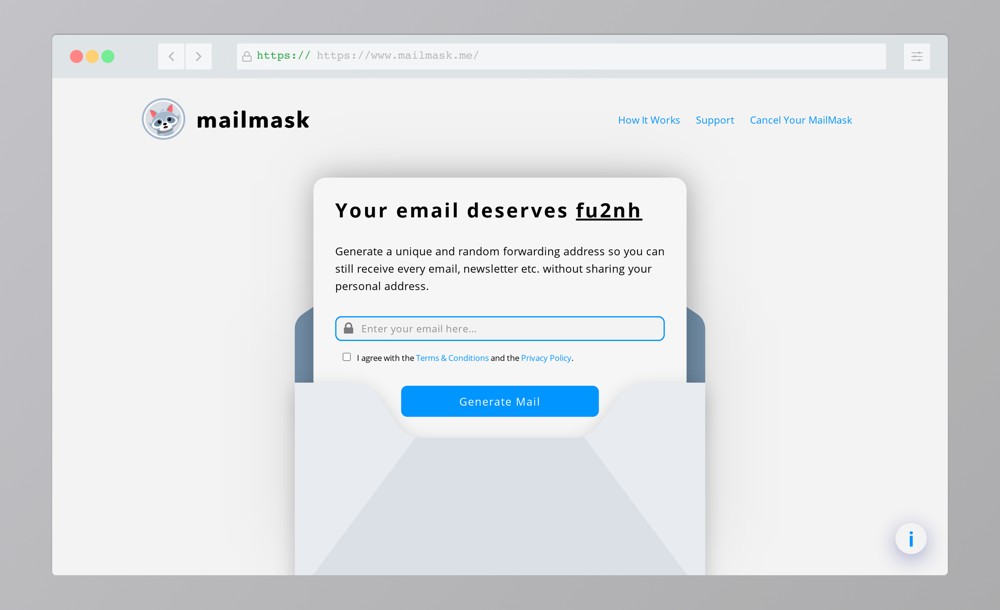

<!-- PROJECT LOGO -->
 

  <a href="https://mailmask.me">
    
     
    
  </a>

  

    Your email deserves privacy!
     
     
    <a href="https://www.mailmask.me/#privacy"><strong>Read the privacy policy »</strong></a>
     
     
    <a href="https://mailmask.me">Test It</a>
    ·
    <a href="https://github.com/othneildrew/Best-README-Template/issues">Report Bug</a>
    ·
    <a href="https://github.com/othneildrew/Best-README-Template/issues">Request Feature</a>
  

<!-- TABLE OF CONTENTS -->

  
Table of Contents

  <ol>
    <li>
      <a href="#about-the-project">About The Project</a>
      <ul>
        <li><a href="#built-with">Built With</a></li>
        <li><a href="#infrastructure">Infrastructure</a></li>
      </ul>
    </li>
    <li><a href="#contributing">Contributing</a></li>
    <li><a href="#license">License</a></li>
    <li><a href="#acknowledgements">Acknowledgements</a></li>
  </ol>

<!-- ABOUT THE PROJECT -->
## About The Project

 

Mailmask started as I searched for a simple solution to get a newsletter without sharing my real emailaddress. Trashmails were my first go-to but due to their temporary nature, the solution was flawed. 
The idea is simple: Generate a random email address that forwards all the incoming mails to your real address. This way the other party only knows your generated address which can not be linked to your real email.

Here is how it works:
* Enter your email address at mailmask.me
* Get a welcome mail with your newly generated mailmask address
* Use the mailmask address to receive emails

All incoming mails are stored in an S3 bucket for further forwarding and are deleted afterwards. In case the code fails for some reason, the emails are also deleted. Mailmask never processes the content of your incoming mails.

### Built With
* [nodeJS](https://nodejs.dev)

### Infrastructure
* [AWS Simple Email Service](https://aws.amazon.com/ses/)
  -> sending and receiving emails
* [AWS Lambda](https://aws.amazon.com/lambda/)
  -> executing the code serverless on-demand
* [AWS S3](https://aws.amazon.com/s3/)
  -> storing the incoming mails for forwarding
* [AWS DynamoDB](https://aws.amazon.com/dynamodb/)
  -> storing the translation matrix
* [AWS Amplify](https://aws.amazon.com/amplify/)
  -> hosting the front-end

<!-- CONTRIBUTING -->
## Contributing

Feel free to contribute to this project. Mailmask should be community driven and implement features that their users want.

1. Fork the Project
2. Create your Feature Branch (`git checkout -b feature/YourFeature`)
3. Commit your Changes (`git commit -m 'Add some feature'`)
4. Push to the Branch (`git push origin feature/YourFeature`)
5. Open a Pull Request

<!-- LICENSE -->
## License

Distributed under the GPL-3.0 License License. See `LICENSE` for more information.

<a href="https://github.com/HSchuette/mailmask/blob/main/LICENSE"><strong>Read License »</strong></a>

<!-- ACKNOWLEDGEMENTS -->
## Acknowledgements
* [Ryan](https://gist.github.com/rs77)
* [Nano ID](https://www.npmjs.com/package/nanoid)
* [Crypto-JS](https://www.npmjs.com/package/crypto-js)